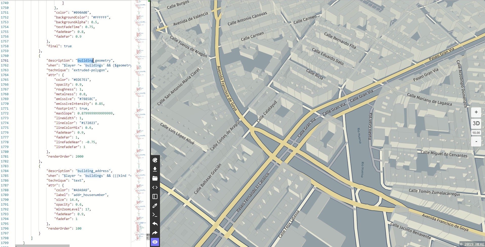

# @here/harp-map-editor [](https://travis-ci.com/heremaps/harp-map-editor)

## Overview

### A simple online editor for harp.gl themes.

Allows you to create and edit existing themes.

The following features are currently available:
 - export and import of themes
 - live preview
 - style change
 - restore page state after page reload
 - default themes
 - code formatting
 - theme source code validation
 - code autocompletion
 - two window mode

When you run the editor, you should get something similar to the image shown below:



## Development

### Prerequisites

-   **Node.js** - Please see [nodejs.org](https://nodejs.org/) for installation instructions.
-   **Yarn** - Optional. Please see [yarnpkg.com](https://yarnpkg.com/en/) for installation instructions.

### Download dependencies

Run:

```sh
npm install
```
or

```sh
yarn install
```

to download and install all required packages.

### Launch development server for harp.gl theme editor

Run:

```sh
yarn start
```

To launch `webpack-dev-server`. Open `http://localhost:8080/` in your favorite browser.

To build the editor run:

```sh
yarn build
```
The build result will be in `dist` folder.

### Update gh-pages automatically

In order to update `gh-pages`, you will need to first disable the branch protection, otherwise
TravisCI won't be able to push to that branch.

Increment the package version and then tag your commit, either locally or if the package version has
been updated already, you can make a release in the GitHub UI and it will create the tag. Note, the
tag must be of the form: `vX.X.X`, because this is how travis knows to publish, see `.travis.yml`

This will automatically start the job to publish, go to TravisCI and check the status and make sure
you see something like: `Switched to a new branch 'gh-pages'`

If you have problems, try fixing it manually below.

### Update gh-pages manually

If you have any trouble with the updating of gh-pages, for example the publish works but the deploy
fails, then restarting the job won't work, because npm will complain that the given package already
exists. Deploying to `gh-pages` will then not be executed. To resolve this, go to the root
directory locally, and run (assuming you have a fresh checkout):
- `git checkout master`
- `yarn && yarn build`
- `mv dist/ ..`
- `git checkout gh-pages`
- `cp -r ../dist/* .`
- `git add *` (you may also need to `git rm` some files if `git status` complains)
- `git push origin gh-pages`

Check that the changes are visible: https://heremaps.github.io/harp-map-editor/

## License

Copyright (C) 2017-2020 HERE Europe B.V.

See the [LICENSE](./LICENSE) file in the root of this project for license details.
